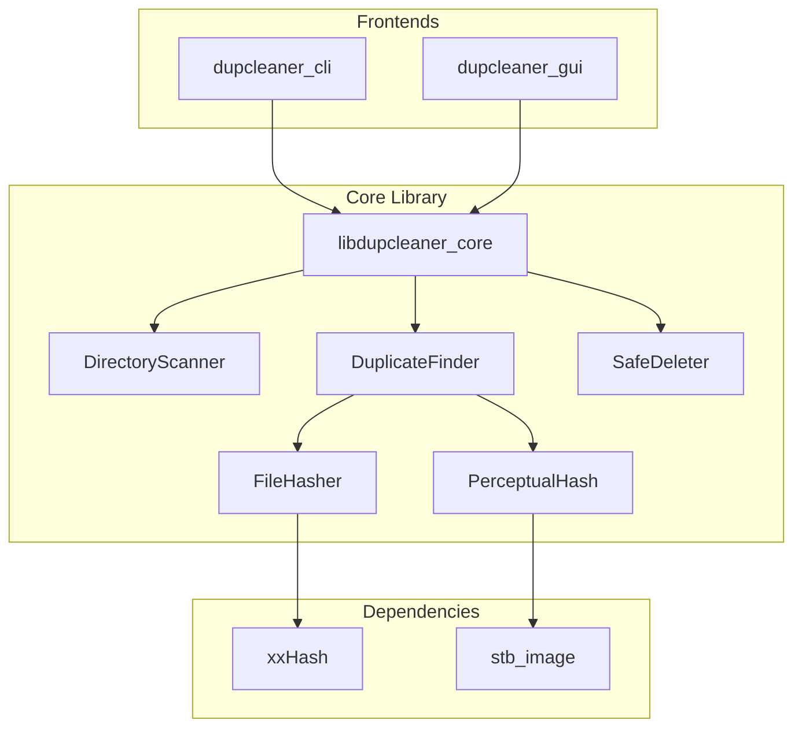
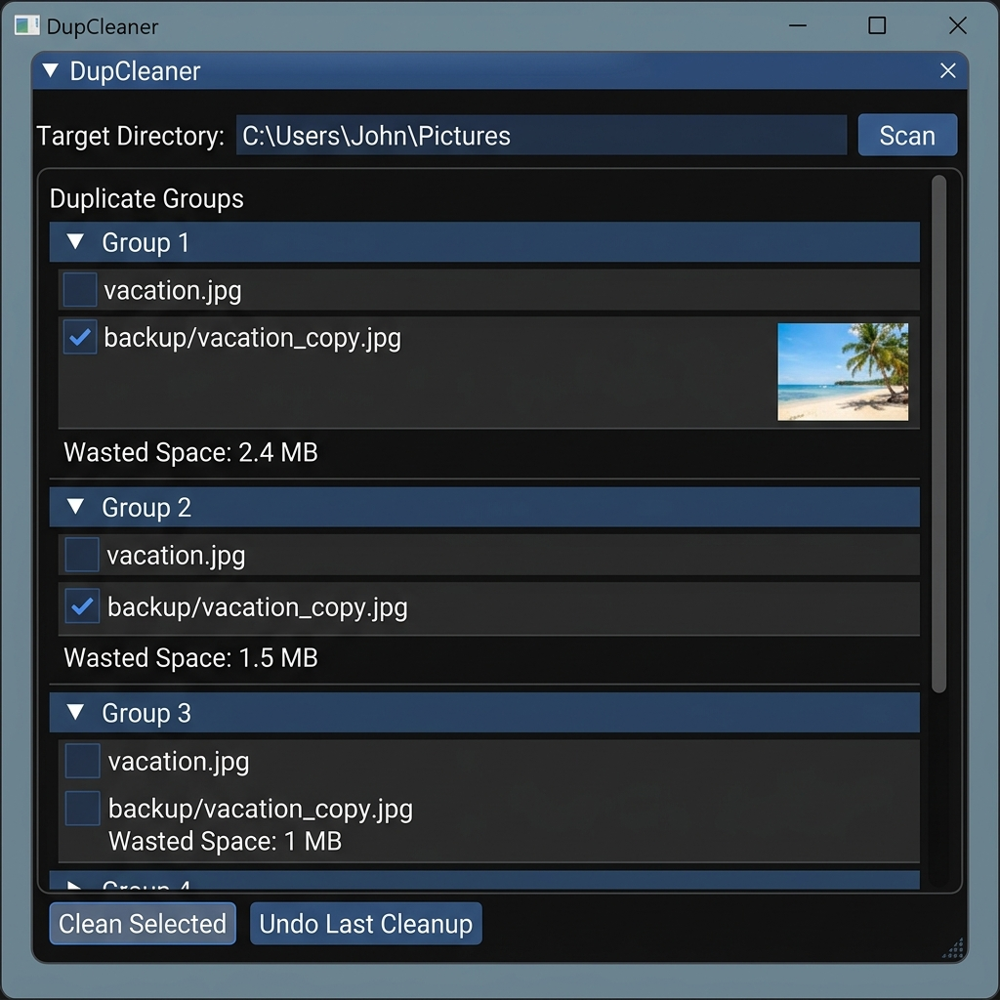

# DupCleaner

[](https://github.com/hamzamir1618/DupCleaner/actions/workflows/ci.yml)

**DupCleaner** is a blazing-fast, cross-platform utility for finding and safely managing exact duplicate files and near-duplicate images (e.g., resized, slightly cropped, compressed photos). It scans your drives, reports exactly how much space is being wasted, and allows you to safely clean up storage using an intuitive Graphical User Interface (GUI) or a powerful Command Line Interface (CLI).

## Features

- [x] **Recursive Directory Scanning:** Quickly scans deep folder trees while gracefully skipping unreadable or broken files.
- [x] **Exact Duplicate Detection:** Groups identical files securely using size filtering followed by high-throughput `xxHash` byte verification.
- [x] **Near-Duplicate Image Detection:** Identifies slightly altered images (like Instagram crops or JPEG compressions) using Perceptual Hashing (dHash).
- [x] **Reclaimable Space Reporting:** Accurately calculates exactly how many bytes you'll save before you delete anything.
- [x] **Safe Deletion:** Moves duplicates to a local `.dupcleaner_trash` directory rather than permanently destroying them immediately.
- [x] **Undo Capabilities:** Made a mistake? Instantly reverse the last cleanup operation to restore files to their exact original locations.
- [x] **CLI Frontend:** Scriptable interface with JSON output, dry-runs, and interactive review modes.
- [x] **GUI Frontend:** A beautiful, dark-themed `Dear ImGui` desktop application featuring visual image thumbnails and point-and-click cleanup.
- [x] **Multi-threaded Performance:** Leverages your entire CPU to parallelize disk reads and image decoding.

---

## Architecture

DupCleaner is built in C++17. It isolates its core logic into `libdupcleaner_core` which is consumed independently by both the CLI and GUI frontends.



---

## Safety Model

Data loss is our biggest enemy. DupCleaner implements a "Trash-by-Default" safety model:
1. When you "clean" files, they are **not** permanently deleted. Instead, they are moved to a hidden directory (`.dupcleaner_trash`) located inside the folder you just scanned.
2. An automatic manifest (`.json`) tracks the exact original absolute pathways of those files.
3. If you realize you deleted the wrong files, you can simply run the `undo` command (or click "Undo Last Cleanup" in the GUI) to restore them perfectly.

*Note: You can bypass this safeguard and invoke irreversible deletion using the `--permanent` flag in the CLI.*

---

## Performance Notes

DupCleaner is engineered for speed, avoiding disk thrashing and redundant hash calculations:
- **Bucket-First Grouping:** Files are only hashed if they have the exact same file size. 
- **Chunked File Reading:** Huge multi-gigabyte ISOs or video files are streamed in 64KB chunks to prevent memory bloat, breaking out early the moment two chunks diverge.
- **Multithreading:** The `DuplicateFinder` uses a bounded `ThreadPool`. Hashing 100+ large files or decoding dozens of near-duplicate images utilizes 100% of available CPU cores simultaneously.
- **Throughput:** In benchmark testing on consumer NVMe drives, exact hashing using `xxHash` successfully processed over 14,000 files in ~190ms.

---

## GUI Usage Guide

For an interactive, visual experience, launch the graphical application:

```bash
dupcleaner_gui
```



1. **Target Directory:** Type or paste the folder path you wish to scan at the top of the window.
2. **Scan:** Click the "Scan" button. The engine runs on a background thread, preventing UI freezes. 
3. **Review:** The interface will populate with scrollable duplicate groups. For images, a visual thumbnail is automatically generated. The space you are about to save is displayed prominently.
4. **Cleanup:** Check or uncheck files to keep/discard. Click **"Clean Selected"** to move the selected files to the trash.
5. **Undo:** Use the **"Undo Last Cleanup"** button to revert your last bulk deletion.

---

## CLI Reference

The CLI binary (`dupcleaner_cli`) is ideal for power users and automation scripts.

### 1. `scan` - Discovering Duplicates
Finds duplicate files and optionally outputs JSON format.

**Command Usage:**
```bash
dupcleaner_cli scan [OPTIONS] path
```

**Options:**
- `--min-size UINT` : Skip files smaller than this (in bytes).
- `--json` : Output report as JSON for programmatic integration.
- `--verbose` : Print skipped paths and detailed stats.
- `--include-near-duplicates` : Also scan for near-duplicate images using perceptual hashing.
- `--similarity-threshold INT` : Hamming distance threshold for near-duplicates (default: 10).

**Example Output:**
```bash
$ dupcleaner_cli scan ./my_photos --min-size 1024
Found 1 exact duplicate groups:

Group 1 (Size: 1048576 bytes, Wasted: 1048576 bytes):
  - C:\my_photos\vacation.jpg
  - C:\my_photos\backup\vacation_copy.jpg

Total wasted space: 1048576 bytes.
```

### 2. `clean` - Removing Duplicates
Analyzes and automatically or interactively deletes duplicates.

**Command Usage:**
```bash
dupcleaner_cli clean [OPTIONS] path
```

**Options:**
- `--min-size UINT` : Skip files smaller than this (in bytes).
- `--strategy TEXT` : Deletion strategy: `oldest`, `newest`, `alpha-first` (default: keeps oldest).
- `--trash` : Move files to `.dupcleaner_trash` (default).
- `--permanent` : Permanently delete files (irreversible!).
- `--dry-run` : Print the deletion plan without modifying the filesystem.
- `--yes` : Skip the `[y/N]` interactive confirmation prompt.
- `--interactive` : Interactively review each duplicate group, allowing you to accept the system suggestion, skip the group, or pick a specific file to keep.
- `--include-near-duplicates` / `--similarity-threshold INT` : Enable cleaning of near-duplicate images.

**Example (Interactive Review):**
```bash
$ dupcleaner_cli clean ./my_photos --interactive
--- Exact Duplicate Group 1 of 1 ---
Reviewing Group:
  [1] C:\my_photos\vacation.jpg (1048576 bytes) (*Suggested*)
  [2] C:\my_photos\backup\vacation_copy.jpg (1048576 bytes)
Action (a=accept suggestion, s=skip group, k<N>=keep file N): k2
```

### 3. `undo` - Restoring Trashed Files
Instantly restores the last batch of files sent to the `.dupcleaner_trash`.

**Command Usage:**
```bash
dupcleaner_cli undo [OPTIONS] path
```

---

## Build Instructions

### Prerequisites
- **Windows / macOS:** Built-in graphics libraries are sufficient.
- **Linux (Ubuntu/Debian):** Requires OpenGL, X11, and Wayland development headers for the GUI.
  ```bash
  sudo apt-get update
  sudo apt-get install build-essential cmake libgl1-mesa-dev xorg-dev libx11-dev libxcursor-dev libxi-dev libxinerama-dev libxrandr-dev libwayland-dev libxkbcommon-dev wayland-protocols
  ```

### Building the Project

The project uses CMake to fetch all third-party dependencies (`xxHash`, `stb_image`, `GoogleTest`, `CLI11`, `Dear ImGui`, `GLFW`) automatically.

```bash
# 1. Clone the repository
git clone https://github.com/hamzamir1618/DupCleaner.git
cd DupCleaner

# 2. Configure the build
cmake -S . -B build -DCMAKE_BUILD_TYPE=Release

# 3. Compile the binaries (CLI and GUI)
cmake --build build --config Release

# 4. Run the automated test suite
ctest --test-dir build --output-on-failure
```

*Note: You can omit building the GUI or Tests by passing `-DDUPCLEANER_BUILD_GUI=OFF` or `-DDUPCLEANER_BUILD_TESTS=OFF` during the configuration step.*

---

## Known Limitations
- **No Native File Picker Dialog:** You must manually type or paste the target directory path into the GUI text box.
- **No Drive Overview Dashboard:** There is no specific visualization mapping disk utilization before running a scan.
- **Cancel Scanning:** Single-threaded scan cancellation is not yet supported. You must wait for a scan to finish before launching a new one in the GUI.

---

## Contributing
Please read our [Contributing Guidelines](CONTRIBUTING.md) before submitting Pull Requests to ensure your tests, documentation, and CI workflows meet project conventions.
